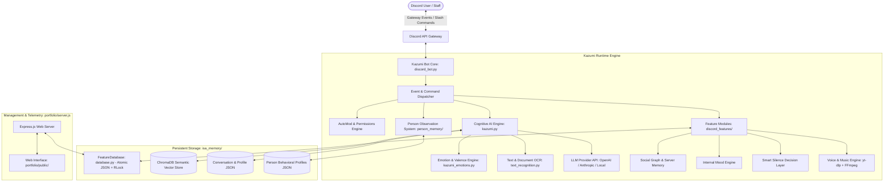
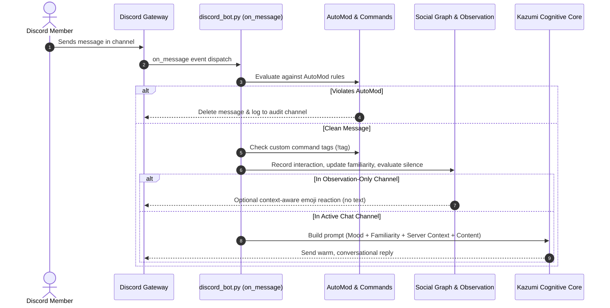

# 🌸 Kazumi System Architecture

This document outlines the architectural design, component interactions, runtime lifecycles, and data storage systems of **Kazumi** — the AI Companion and Discord Bot.

---

## 1. High-Level Architecture Overview

---

## 2. Core Components & Entry Points

### 2.1 Entry Points
- **Primary Discord Gateway Daemon**: [`discord_bot.py`](file:///c:/Users/Lenovo/kazumi%20(gravity)/discord_bot.py)
  - Initializes single-instance concurrency lock (Named Mutex on Windows + Port 49281 TCP lock).
  - Configures Discord Gateway connector with IPv4 forced resolution (`aiohttp.TCPConnector(family=socket.AF_INET)`).
  - Starts asynchronous listeners and periodic background workers.
- **Cognitive Chat Core**: [`kazumi.py`](file:///c:/Users/Lenovo/kazumi%20(gravity)/kazumi.py)
  - Encapsulates multi-turn memory, profile affection metrics (0–100%), emotional valence, and LLM query orchestration.
- **Web Dashboard**: [`portfolio/server.js`](file:///c:/Users/Lenovo/kazumi%20%28gravity%29/portfolio/server.js)
  - Express.js HTTP daemon serving web interface and REST telemetry endpoints for bot status, moderation records, tickets, and giveaways.

---

## 3. Discord Client & Gateway Lifecycle

1. **Intents Configured**:
   - `intents.guilds = True`
   - `intents.members = True` (Privileged Member intent for AutoRole, Welcome/Goodbye, and Nickname/Role logs)
   - `intents.messages = True`
   - `intents.message_content = True` (Privileged Message Content intent for AutoMod, tag prefixes, and conversational listening)
   - `intents.reactions = True`
   - `intents.voice_states = True` (For voice music playback)
2. **Reconnection & Resilience**:
   - `on_disconnect()`: Automatically logs connection drops.
   - `on_resumed()`: Confirms seamless session resumption without state loss.
   - Auto-retry with exponential backoff on unexpected gateway disconnects.

---

## 4. Command & Event Processing Pipeline

---

## 5. Memory & Persistence Architecture

Kazumi avoids external database servers by utilizing thread-safe, atomic file persistence under `isa_memory/`:

1. **Atomic Write Guarantee**:
   All database writes in `FeatureDatabase` (`discord_features/database.py`) write first to a `.tmp` file, flush buffers, call `os.fsync(fileno)`, and atomically replace the target file with `.bak` rollback protection.
2. **Re-entrant Thread Safety**:
   Protected by `threading.RLock()` across all reads and writes.
3. **Storage Files**:
   - `guild_settings.json`: AutoMod rules, log channels, welcome cards, and ticket settings.
   - `moderation_records.json`: Formal warnings and audit logs.
   - `tickets.json`: Active and archived support tickets.
   - `giveaways.json`: Active giveaways, entries, and winner states.
   - `custom_commands.json`: Per-guild custom text tags.
   - `reaction_roles.json`: Interactive button-to-role mappings.
   - `reminders.json`: Scheduled alerts with timestamp queues.
   - `social_graph.json`: User familiarity levels, communication styles, and topic tags.
   - `server_memory.json`: Channel purposes, server mood, and community context.
   - `conversations.json`: Cognitive chat dialogue history buffer.
